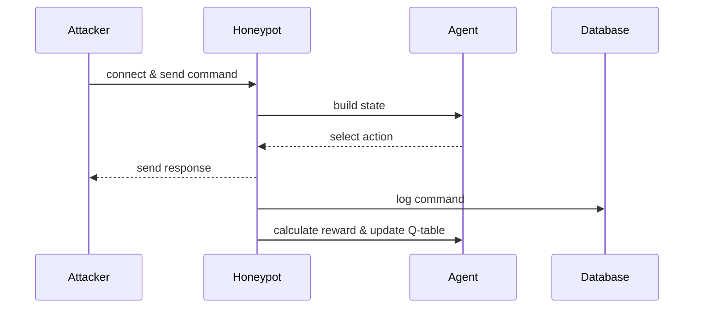

# RL-Honeypot

An adaptive, local-only, low-interaction honeypot for teaching, experimentation,
and reproducible security analysis. The project compares fixed honeypot
policies against an RL-based honeypot that uses tabular Q-learning, behavioural
classification, and profile-aware action priors to choose response strategies.

---

ENGLISH
=======

## Table of Contents

- [Overview](#overview)
- [Features](#features)
- [Quick Start](#quick-start)
- [Architecture & Design](#architecture--design)
- [Q-Learning Details](#q-learning-details)
- [Configuration](#configuration)
- [Usage Examples](#usage-examples)
- [Troubleshooting](#troubleshooting)
- [Contributing](#contributing)
- [License & Contact](#license--contact)

---

## Overview

RL-Honeypot runs two honeypot variants side-by-side:

- Static baseline (port 2323) — deterministic simple responses
- RL adaptive (port 2324) — ε-greedy tabular Q-learning selects from several
  response strategies

All sessions and commands are logged to SQLite. A Streamlit dashboard displays
session summaries, engagement metrics, fixed-policy comparisons, multi-seed
evaluation results, reward curves, and the learned Q-table.

The main research question is whether an adaptive honeypot can match or exceed
the strongest fixed response policy across mixed attacker profiles. In the
current multi-seed benchmark, the RL policy slightly exceeds the aggregate best
fixed baseline while remaining far above the random baseline.

---

## Features

- Local-only: binds to `127.0.0.1`, non-privileged ports
- Two-mode comparison: `static` vs `rl`
- Live Streamlit dashboard
- Pluggable response strategies
- Configurable reward shaping and epsilon schedule
- Attacker simulator with three profiles (bot, script_kiddie, operator)
- Fast offline trainer for reproducible benchmark runs
- Multi-seed evaluation with mean, standard deviation, min, and max metrics
- Profile-aware state hinting (`BOT`, `SCRIPT`, `OPERATOR`, `UNKNOWN`)

---

## Quick Start

1. Create and activate a virtual environment; install dependencies:

```bash
python -m venv .venv
source .venv/bin/activate
pip install -r requirements.txt
```

2. Recommended launch command:

```bash
chmod +x launch.sh
./launch.sh --no-sim
```

This opens the static honeypot, RL honeypot, and dashboard. The simulator is
disabled with `--no-sim` so you can start traffic manually when needed.

3. Full demo launch with simulator:

```bash
./launch.sh --sessions 50
```

4. Manual run option (use separate terminals):

```bash
# Static honeypot (baseline)
python honeypot_static.py

# RL honeypot (agent)
python honeypot_rl.py

# Simulator to generate sessions
python simulate_attacker.py --mode rl --sessions 30

# (Optional) Dashboard
streamlit run dashboard.py
```

5. Open the Streamlit URL shown (usually `http://localhost:8501`).

---

## Architecture & Design

Components:

- `config.py` — centralised constants and hyperparameters
- `database.py` — SQLite persistence for `sessions` and `commands`
- `response_strategies.py` — implementations of response behaviours
- `q_learning_agent.py` — state builder, ε-greedy agent, reward calculator
- `honeypot_static.py` / `honeypot_rl.py` — server implementations
- `simulate_attacker.py` — attacker behaviour simulator
- `dashboard.py` — Streamlit UI

Design notes:

- Thread-per-connection: simple and easy to trace in a teaching environment
- Persistence: SQLite enables offline analysis and dashboarding
- Safety: no shell execution, no real credentials, bind to `127.0.0.1`
- Reproducibility: offline training and evaluation use deterministic seeds

Sequence diagram:



---

## Q-Learning Details

State representation:

- `last_3_command_categories` — sliding window of last 3 categories
- `tempo` — typing speed bucket (`SLOW`, `NORMAL`, `FAST`)
- `behavior_class` — `BOT`, `HUMAN`, or `UNKNOWN`
- `depth` — session stage bucket (`EARLY`, `MID`, `LATE`)
- `profile_hint` — inferred coarse profile (`BOT`, `SCRIPT`, `OPERATOR`, `UNKNOWN`)

Actions:

0. `SILENT_ERROR` — command not found
1. `FAKE_SUCCESS` — realistic fake success output
2. `DECOY_LURE` — success + hint toward fake files
3. `SLOW_RESPONSE` — artificial delay
4. `HONEYTRAP_OFFER` — lure toward high-value fake target

Reward (high-level):

- Engagement if attacker sends another command (+1.0)
- Diversity when a new command category appears (+1.5)
- Lure success bonus (+3.0)
- Human multiplier (×1.5), Bot penalty (−2.0), Disconnect penalty (−1.0)

Q-table persistence: `q_table.json`.

Evaluation is separated from training. Training keeps exploration enabled
(`epsilon` decays to `0.05`), while learned-policy evaluation temporarily uses
`epsilon=0.00` and performs no Q-table updates. The main reported result uses
10 deterministic evaluation seeds to show that the result is not a one-seed
accident.

Current offline benchmark (`100000` training sessions, `10` evaluation seeds,
`8000` RL evaluation sessions per seed):

| Metric | Value |
|--------|-------|
| Training sessions | 100,000 |
| Evaluation seeds | 10 |
| RL eval sessions per seed | 8,000 |
| Baseline sessions per policy/seed | 3,000 |
| Learned states | 2,432 |
| RL reward mean ± std | 399.39 ± 5.96 |
| RL reward min / max | 390.50 / 409.55 |
| Random baseline mean | 204.34 |
| Best fixed baseline | always_decoy_lure |
| Best fixed mean ± std | 398.82 ± 8.36 |
| Success vs best fixed | 100.14% |
| RL vs random | +95.46% |
| Gap to best fixed | +0.14% |
| Per-seed success min / max | 96.93% / 103.31% |

---

## Configuration

All key parameters are in `config.py`. Typical knobs to experiment with:

- `epsilon_start`, `epsilon_decay`, `epsilon_min`
- `ACTION_PRIOR_WEIGHT` for the state-aware exploitation prior
- reward weights for engagement, diversity, lure
- response strategy definitions in `response_strategies.py`

---

## Usage Examples

- Quick RL run with simulated traffic:

```bash
python honeypot_rl.py &
python simulate_attacker.py --mode rl --sessions 200
```

- Launch dashboard and honeypot services through the script:

```bash
./launch.sh --no-sim
```

- Fast offline Q-table training without socket delays:

```bash
python train_model.py --reset --sessions 100000 --seed 20260603 \
  --compare-baselines --baseline-sessions 3000 --eval-sessions 8000 \
  --eval-seed-count 10 --eval-seed-stride 17
```

- Inspect Q-table after a run:

```bash
python -c "import json; print(json.dumps(json.load(open('q_table.json')), indent=2))"
```

---

## Troubleshooting

- Port already in use: `lsof -i :2323` / `lsof -i :2324` and kill the PID
- Dashboard empty: run the simulator to populate the DB, then refresh Streamlit
- `q_table.json` missing: it's generated after the RL agent persists the table

---

## Contributing

Contributions welcome. Suggested improvements:

- more realistic attacker profiles
- richer dashboard visualisations
- tests for reward calculation and state building

Please open an issue or PR; follow repository style and include tests where
possible.

---

## License & Contact

This repository is intended for educational use. Add a `LICENSE` file if you
plan to publish with a specific license.

Maintainer: local repo owner — open an issue for questions.

---

TÜRKÇE
======

## Genel Bakış

RL-Honeypot, yerel ve kontrollü bir ortamda çalışan düşük etkileşimli bir
adaptif honeypot projesidir. Amaç, sabit yanıt politikaları ile pekiştirmeli
öğrenme tabanlı adaptif bir honeypot politikasını karşılaştırmaktır.

Proje iki honeypot modunu birlikte çalıştırır:

- Statik honeypot (`2323`) — sabit ve deterministik yanıtlar
- RL honeypot (`2324`) — Q-learning ile duruma göre strateji seçen adaptif ajan

Tüm oturumlar ve komutlar SQLite veritabanına kaydedilir. Streamlit dashboard;
canlı trafik, oturum metrikleri, reward eğrileri, Q-table durumu, baseline
karşılaştırmaları ve 10-seed evaluation sonuçlarını gösterir.

---

## Özellikler

- Yerel çalışma (`127.0.0.1`), ayrıcalıksız portlar
- Statik honeypot ve RL honeypot karşılaştırması
- Streamlit dashboard ile görsel analiz
- Bot, script_kiddie ve operator attacker profilleri
- Beş yanıt stratejisi: silent error, fake success, decoy lure, slow response, honeytrap offer
- Q-learning tabanlı öğrenme ve epsilon-greedy keşif
- `profile_hint` ile kaba profil çıkarımı: `BOT`, `SCRIPT`, `OPERATOR`, `UNKNOWN`
- Offline eğitim ve çoklu seed evaluation desteği
- Güvenli simülasyon: gerçek komut çalıştırılmaz, gerçek credential kullanılmaz

---

## Hızlı Başlangıç

1. Sanal ortam oluşturun ve bağımlılıkları yükleyin:

```bash
python -m venv .venv
source .venv/bin/activate
pip install -r requirements.txt
```

2. Önerilen çalışma şekli:

```bash
chmod +x launch.sh
./launch.sh --no-sim
```

Bu komut static honeypot, RL honeypot ve dashboard'u başlatır. `--no-sim`
parametresi simülatörü otomatik başlatmaz; istersen trafiği daha sonra ayrı
komutla üretebilirsin.

3. Simülatör dahil tam demo:

```bash
./launch.sh --sessions 50
```

4. Manuel çalıştırma:

```bash
python honeypot_static.py
python honeypot_rl.py
python simulate_attacker.py --mode rl --sessions 30
streamlit run dashboard.py
```

Dashboard genellikle şu adreste açılır:

```text
http://localhost:8501
```

---

## Mimari ve Tasarım

Ana modüller:

- `config.py` — hiperparametreler, reward ağırlıkları ve port ayarları
- `database.py` — SQLite oturum/komut kayıtları
- `response_strategies.py` — sahte honeypot yanıt stratejileri
- `q_learning_agent.py` — davranış sınıflandırıcı, state builder, Q-learning ajanı
- `honeypot_static.py` — statik baseline honeypot
- `honeypot_rl.py` — RL tabanlı adaptif honeypot
- `simulate_attacker.py` — saldırgan profili simülatörü
- `train_model.py` — hızlı offline eğitim ve evaluation
- `dashboard.py` — Streamlit dashboard
- `launch.sh` — servisleri tek komutla başlatma scripti

Güvenlik sınırları:

- Sistem komutu çalıştırılmaz.
- Tüm çıktılar sahte ve simülasyon amaçlıdır.
- Proje yalnızca localhost üzerinde çalışır.
- Kullanılan credential ve hedefler gerçek değildir.

---

## Q-Öğrenme Detayları

State temsili:

- Son 3 komut kategorisi
- Tempo: `SLOW`, `NORMAL`, `FAST`
- Davranış sınıfı: `BOT`, `HUMAN`, `UNKNOWN`
- Oturum derinliği: `EARLY`, `MID`, `LATE`
- Profil ipucu: `BOT`, `SCRIPT`, `OPERATOR`, `UNKNOWN`

Eylemler:

0. `SILENT_ERROR`
1. `FAKE_SUCCESS`
2. `DECOY_LURE`
3. `SLOW_RESPONSE`
4. `HONEYTRAP_OFFER`

Reward fonksiyonu saldırganı daha uzun süre içeride tutmayı, yeni komut
kategorilerini gözlemlemeyi ve yüksek değerli TTP aşamalarına ilerlemeyi teşvik
eder. Bot benzeri oturumlar yavaşlatılır veya caydırılır; script-like oturumlarda
decoy lure, operator-like oturumlarda honeytrap offer daha avantajlı hale gelir.

Eğitim ve değerlendirme ayrıdır: eğitim sonunda keşif oranı `epsilon=0.05`
kalır, değerlendirme/test aşamasında ise öğrenilmiş politika `epsilon=0.00`
ile ölçülür. Güncel 10-seed offline sonuçta RL politika en iyi sabit
baseline'ı ortalamada geçmiştir: başarı `100.14%`, best fixed farkı `+0.14%`,
random baseline'a göre iyileşme `+95.46%`.

## Güncel Benchmark

| Metrik | Değer |
|--------|-------|
| Eğitim oturumu | 100,000 |
| Evaluation seed sayısı | 10 |
| Seed başına RL test oturumu | 8,000 |
| Seed/policy başına baseline oturumu | 3,000 |
| Öğrenilen state sayısı | 2,432 |
| RL reward ortalama ± std | 399.39 ± 5.96 |
| RL reward min / max | 390.50 / 409.55 |
| Random baseline ortalaması | 204.34 |
| En iyi sabit baseline | always_decoy_lure |
| En iyi sabit baseline ortalama ± std | 398.82 ± 8.36 |
| Best fixed'e göre başarı | 100.14% |
| Best fixed farkı | +0.14% |
| Random'a göre iyileşme | +95.46% |
| Seed bazlı başarı min / max | 96.93% / 103.31% |

Benchmark'ı yeniden üretmek için:

```bash
python train_model.py --reset --sessions 100000 --seed 20260603 \
  --compare-baselines --baseline-sessions 3000 --eval-sessions 8000 \
  --eval-seed-count 10 --eval-seed-stride 17
```

---

## Sorun Giderme

- Port kullanım hatası: `lsof -i :2323` veya `lsof -i :2324` ile PID bulun
- Pano boş: simülatörü çalıştırıp veritabanını doldurun
- Dashboard eski sonucu gösteriyorsa tarayıcıyı yenileyin veya Streamlit sürecini kapatıp tekrar `./launch.sh --no-sim` çalıştırın
- `q_table.json` yoksa offline eğitim komutunu çalıştırın

---
