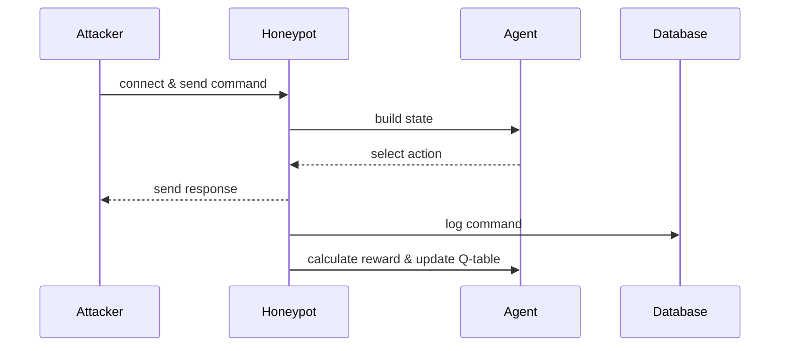

# RL-Honeypot

An adaptive, local-only, low-interaction honeypot designed for teaching,
experimentation, and reproducible analysis. This project compares a static
baseline to an RL-based honeypot that uses tabular Q-learning to select
response strategies based on attacker behaviour.

---

ENGLISH
=======

## Table of Contents

- [Overview](#overview)
- [Features](#features)
- [Quick Start](#quick-start)
- [Architecture & Design](#architecture--design)
- [Q-Learning Details](#q-learning-details)
- [Configuration](#configuration)
- [Usage Examples](#usage-examples)
- [Troubleshooting](#troubleshooting)
- [Contributing](#contributing)
- [License & Contact](#license--contact)

---

## Overview

RL-Honeypot runs two honeypot variants side-by-side:

- Static baseline (port 2323) — deterministic simple responses
- RL adaptive (port 2324) — ε-greedy tabular Q-learning selects from several
  response strategies

All sessions and commands are logged to SQLite. A Streamlit dashboard displays
session summaries, engagement metrics, reward curves and the learned Q-table.

---

## Features

- Local-only: binds to `127.0.0.1`, non-privileged ports
- Two-mode comparison: `static` vs `rl`
- Live Streamlit dashboard
- Pluggable response strategies
- Configurable reward shaping and epsilon schedule
- Attacker simulator with three profiles (bot, script_kiddie, operator)

---

## Quick Start

1. Create and activate a virtual environment; install dependencies:

```bash
python -m venv .venv
source .venv/bin/activate
pip install -r requirements.txt
```

2. Run the services (use separate terminals):

```bash
# Static honeypot (baseline)
python honeypot_static.py

# RL honeypot (agent)
python honeypot_rl.py

# Simulator to generate sessions
python simulate_attacker.py --mode rl --sessions 30

# (Optional) Dashboard
streamlit run dashboard.py
```

3. Open the Streamlit URL shown (usually `http://localhost:8501`).

---

## Architecture & Design

Components:

- `config.py` — centralised constants and hyperparameters
- `database.py` — SQLite persistence for `sessions` and `commands`
- `response_strategies.py` — implementations of response behaviours
- `q_learning_agent.py` — state builder, ε-greedy agent, reward calculator
- `honeypot_static.py` / `honeypot_rl.py` — server implementations
- `simulate_attacker.py` — attacker behaviour simulator
- `dashboard.py` — Streamlit UI

Design notes:

- Thread-per-connection: simple and easy to trace in a teaching environment
- Persistence: SQLite enables offline analysis and dashboarding
- Safety: no shell execution, no real credentials, bind to `127.0.0.1`

Sequence diagram:



---

## Q-Learning Details

State representation:

- `last_3_command_categories` — sliding window of last 3 categories
- `tempo` — typing speed bucket (`SLOW`, `NORMAL`, `FAST`)
- `behavior_class` — `BOT`, `HUMAN`, or `UNKNOWN`

Actions:

0. `SILENT_ERROR` — command not found
1. `FAKE_SUCCESS` — realistic fake success output
2. `DECOY_LURE` — success + hint toward fake files
3. `SLOW_RESPONSE` — artificial delay
4. `HONEYTRAP_OFFER` — lure toward high-value fake target

Reward (high-level):

- Engagement if attacker sends another command (+1.0)
- Diversity when a new command category appears (+1.5)
- Lure success bonus (+3.0)
- Human multiplier (×1.5), Bot penalty (−2.0), Disconnect penalty (−1.0)

Q-table persistence: `q_table.json`.

---

## Configuration

All key parameters are in `config.py`. Typical knobs to experiment with:

- `epsilon_start`, `epsilon_decay`, `epsilon_min`
- reward weights for engagement, diversity, lure
- response strategy definitions in `response_strategies.py`

---

## Usage Examples

- Quick RL run with simulated traffic:

```bash
python honeypot_rl.py &
python simulate_attacker.py --mode rl --sessions 200
```

- Fast offline Q-table training without socket delays:

```bash
python train_model.py --reset --sessions 5000 --seed 20260603
```

- Inspect Q-table after a run:

```bash
python -c "import json; print(json.dumps(json.load(open('q_table.json')), indent=2))"
```

---

## Troubleshooting

- Port already in use: `lsof -i :2323` / `lsof -i :2324` and kill the PID
- Dashboard empty: run the simulator to populate the DB, then refresh Streamlit
- `q_table.json` missing: it's generated after the RL agent persists the table

---

## Contributing

Contributions welcome. Suggested improvements:

- more realistic attacker profiles
- richer dashboard visualisations
- tests for reward calculation and state building

Please open an issue or PR; follow repository style and include tests where
possible.

---

## License & Contact

This repository is intended for educational use. Add a `LICENSE` file if you
plan to publish with a specific license.

Maintainer: local repo owner — open an issue for questions.

---

TÜRKÇE
======

## Genel Bakış

RL-Honeypot, yerel ve kontrollü bir ortamda iki honeypot yaklaşımını karşılaştırır:

- Statik (2323) — sabit yanıtlar
- RL tabanlı (2324) — ε-greedy tablo tabanlı Q-öğrenme ile uyarlanabilen yanıtlar

Tüm oturumlar SQLite'a kaydedilir; Streamlit panosu canlı metrikler ve Q-tablosu
gösterir.

---

## Özellikler

- Yerel çalışma (`127.0.0.1`), ayrıcalıksız portlar
- Statik ve RL modları
- Streamlit pano
- Değiştirilebilir yanıt stratejileri
- Konfigüre edilebilir ödül fonksiyonu

---

## Hızlı Başlangıç

1. Sanal ortam oluşturun ve bağımlılıkları yükleyin:

```bash
python -m venv .venv
source .venv/bin/activate
pip install -r requirements.txt
```

2. Bileşenleri çalıştırın (ayrı terminaller):

```bash
python honeypot_static.py
python honeypot_rl.py
python simulate_attacker.py --mode rl --sessions 30
streamlit run dashboard.py
```

---

## Mimari ve Tasarım

Ana modüller: `config.py`, `database.py`, `response_strategies.py`,
`q_learning_agent.py`, `honeypot_static.py`, `honeypot_rl.py`, `dashboard.py`.

Güvenlik: hiçbir yerde gerçek komut çalıştırılmaz; sahte içerikler kullanılır.

---

## Q-Öğrenme Detayları

Durum ve eylemler aynıdır; ödül yapısı etkileşim, çeşitlilik ve tuzak etkileşimini
teşvik edecek şekilde tasarlanmıştır.

---

## Sorun Giderme

- Port kullanım hatası: `lsof -i :2323` ile PID bulun, kapatın
- Pano boş: simülatörü çalıştırıp veritabanını doldurun

---


